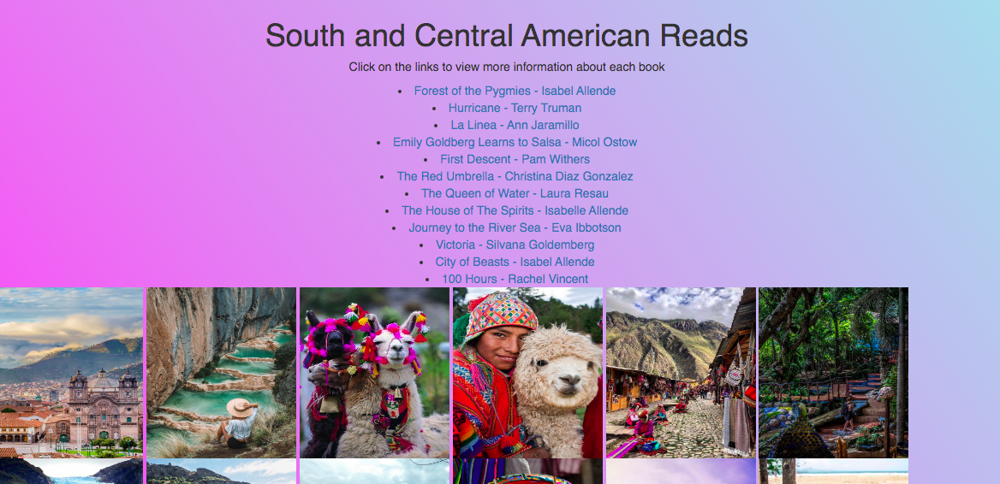
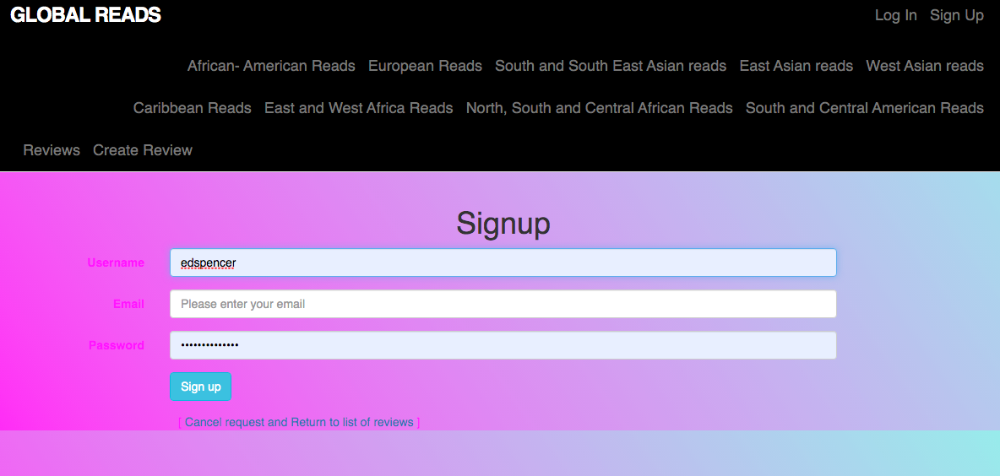
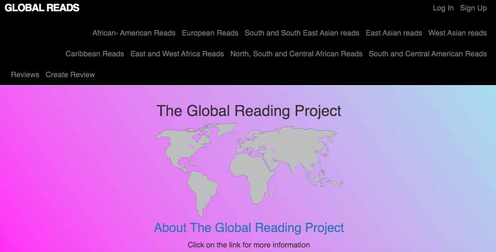
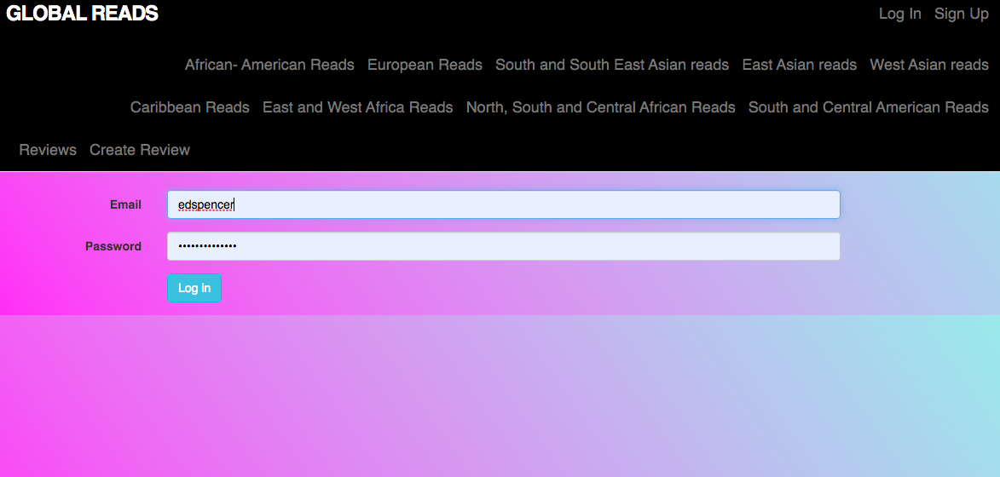
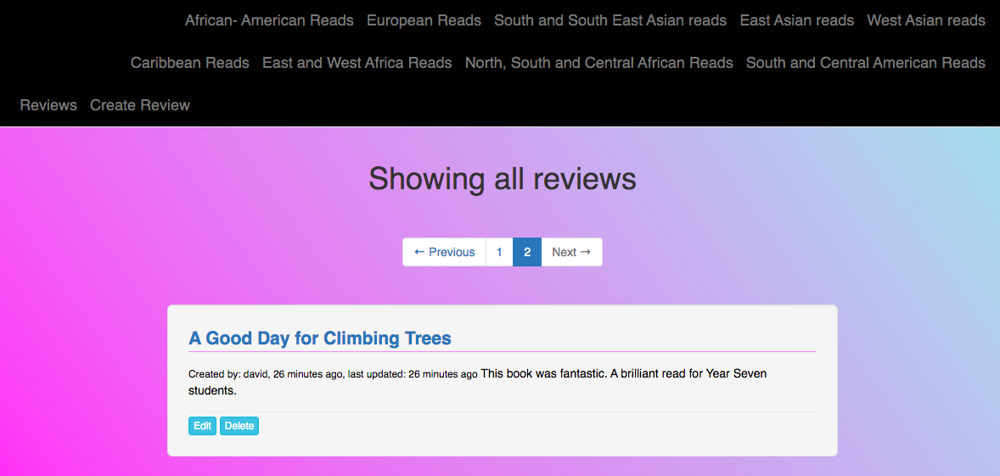
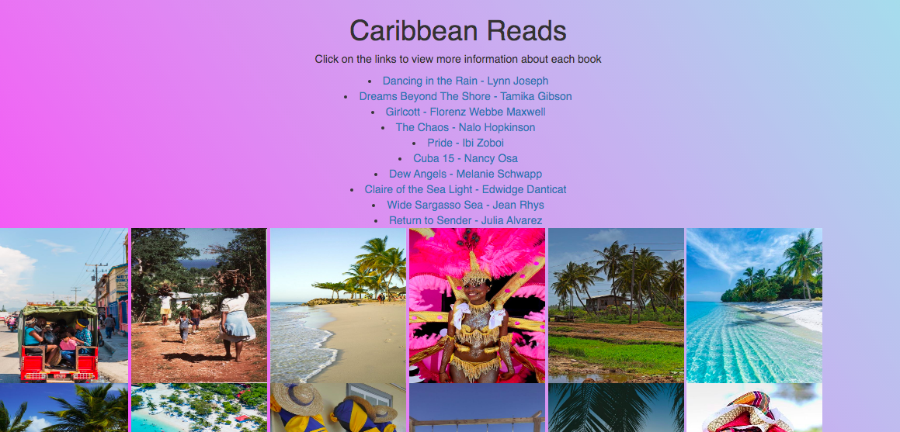

# Global Reads

## About Global Reads

## User Stories

## How to run

* Clone the project - git clone https://github.com/emilyjspencer/Global-Reads.git
* cd into the repo 
* Run bundle install
* Type: rails s (to start the server)
* Go to the following address in the browser: localhost:3000

### How to run the tests

* Type the following into the terminal: rspec

## Built with

* Ruby
* Rails
* HTML/CSS

## Tested with

* RSpec
* Capybara

## What it looks like 

